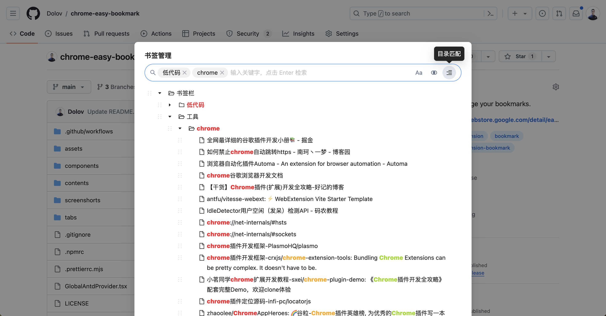
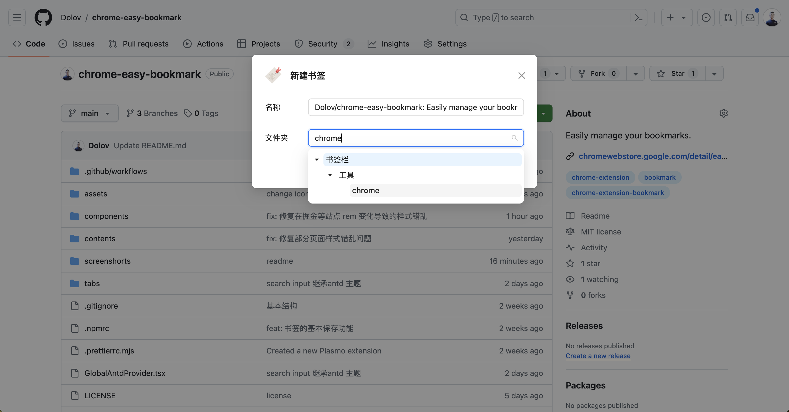
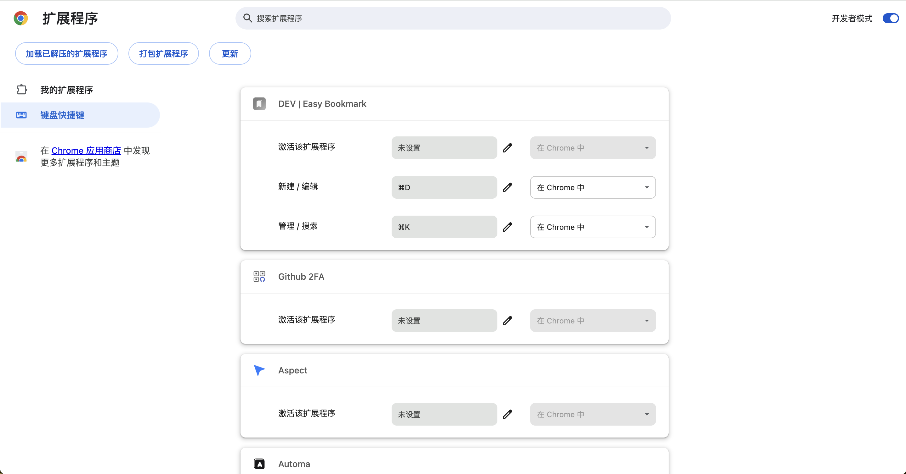

# Easily manage your bookmarks.

## Manange or search

## Create or edit

## Feature

<!-- - 保存书签时支持父级文件夹的树级搜索
- 支持在当前页面快捷键打开书签管理页
- 管理页支持搜索、删除、移动、下载等
- 支持多种搜索匹配模式，多关键字搜索、大小写、交集并集、混合匹配、标题匹配、文件夹匹配等
- UI 界面简洁精致，简化用户操作 -->
- Support hierarchical search of parent folders when saving bookmarks.
- Enable shortcut keys to quickly open the bookmark management page on the current page.
- The management page supports functions such as searching, deleting, moving, and downloading.
- Support various search matching modes, including multi-keyword search, case sensitivity, intersection and union, mixed matching, title matching, folder matching, etc.
- The UI interface is simple and exquisite, simplifying user operations.

## Setting Shortcut Keys
open page [chrome://extensions/shortcuts](chrome://extensions/shortcuts)

<!-- 该扩展的快捷键分为两个，一个是新建或编辑书签，一个是搜索或管理书签。使用者可以根据自己的喜好进行设置，不要与系统快捷键或其他扩展快捷键冲突即可。我喜欢使用的快捷键是 command+D 和 command+K。 -->

The shortcut keys for this extension are divided into two: one for creating or editing bookmarks, and the other for searching or managing bookmarks. Users can customize according to their preferences, ensuring no conflicts with system shortcuts or other extension shortcuts. 

The shortcut keys I prefer to use are <b>command+D</b> and <b>command+K</b>.

